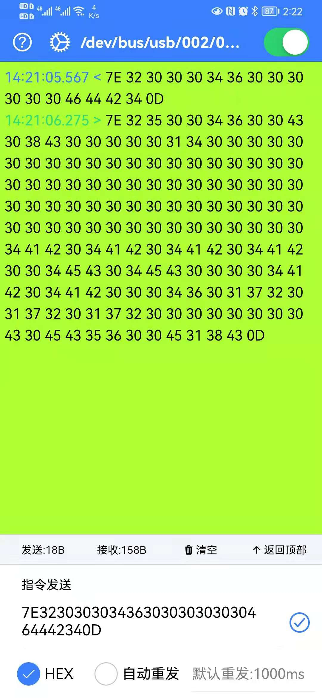

# ionic-serial-port-app

A serial port tool by ionic frame, use plugin is cordova-plugin-usbserialport. Is only run in Android, iOS is not supported.

**Upcoming features**  

- Internationalization: Chinese/English/Korean/Thai
- Individualization: Theme

## Clone and install

### Clone

```bash
git clone https://github.com/king2088/ionic-serial-port-app.git;
```

### Install

```bash
npm install
```

## Package

Make sure [ionic](https://ionicframework.com/) and [cordova](http://cordova.apache.org/) is installed on your computer

### Build develop package

```bash
ionic cordova build android
```

### Build prodction package

```bash
ionic cordova build android --prod
```

### Build release package

```bash
ionic cordova build android --prod --release
```

### Sign

#### Generate signature file  

```bash
keytool -genkey -v -keystore key.keystore -alias you_name -keyalg RSA -keysize 2048 -validity 10000
```

You can modify alias 'you_name' to any words

#### APK Sign

Generate a new signed app-signed.apk file in the root directory

```shell
jarsigner -verbose -keystore .\release-key.jks -signedjar app-signed.apk .\platforms\android\app\build\outputs\apk\release\app-release-unsigned.apk kexin -tsa http://sha256timestamp.ws.symantec.com/sha256/timestamp
```
